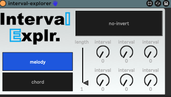

# Interval Explorer

A Max for Live MIDI device for exploring musical interval combinations and chord voicings.

## Features

- Generate and explore combinations of MIDI intervals
- Stack intervals to create chord voicings
- Support for interval inversions (negative intervals)
- Interactive interface for real-time MIDI experimentation
- Customizable 'k' parameter for controlling combination size

## Technical Details

Built with Max for Live, this MIDI device uses combinatorial mathematics to:
1. Generate k-combinations of selected intervals
2. Stack intervals to create MIDI note patterns
3. Support negative intervals for inversions
4. Process and output MIDI in real-time

## Usage

1. Drop the device onto a MIDI track in Ableton Live
2. Input your desired intervals
3. Adjust the 'k' parameter to control how many intervals to combine
4. Toggle negative intervals to explore inversions
5. Play MIDI notes to experiment with the results

## In Action

This device was used to create a piece for player piano titled "Pianoid II":

👆 Click the image to watch the video on YouTube
